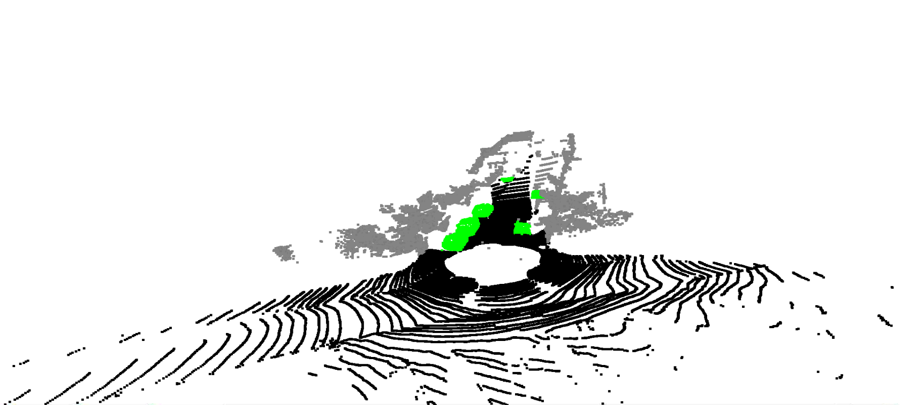
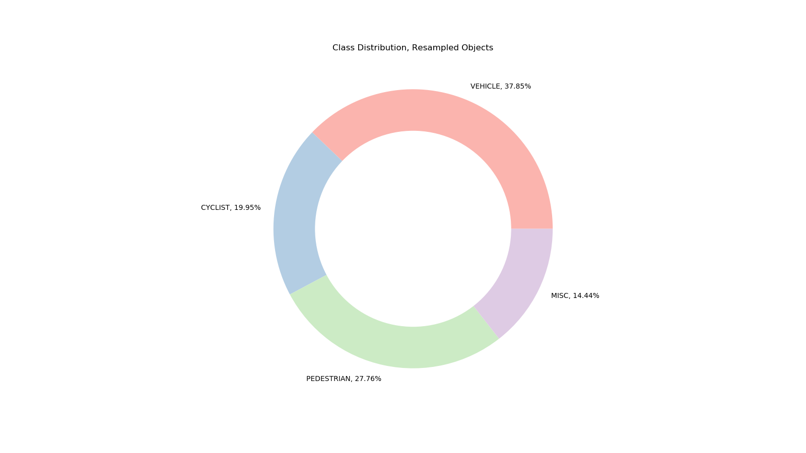
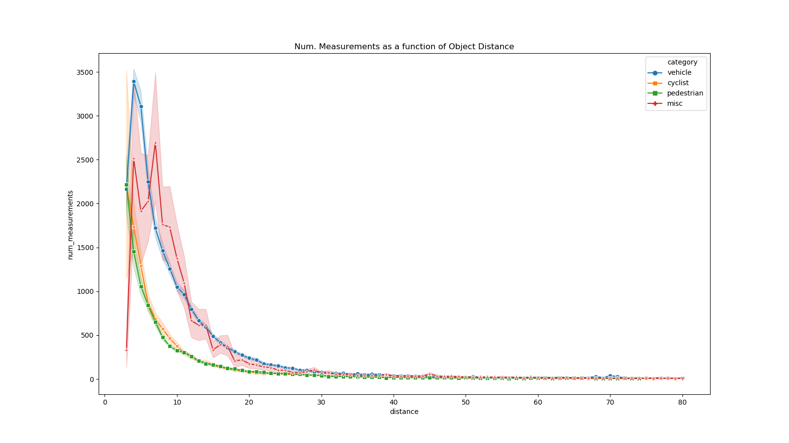
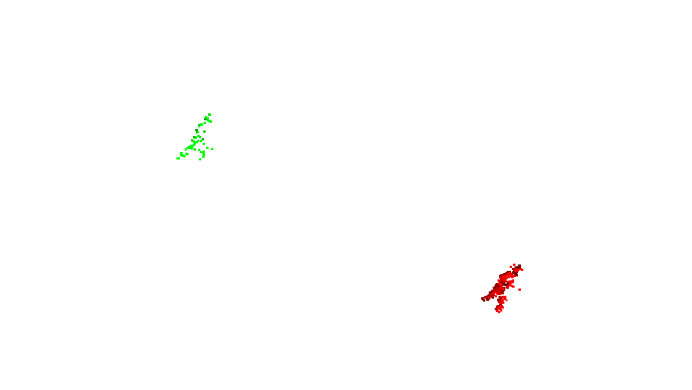
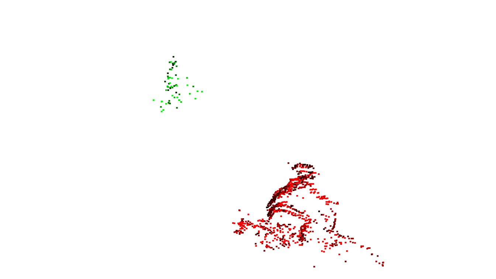
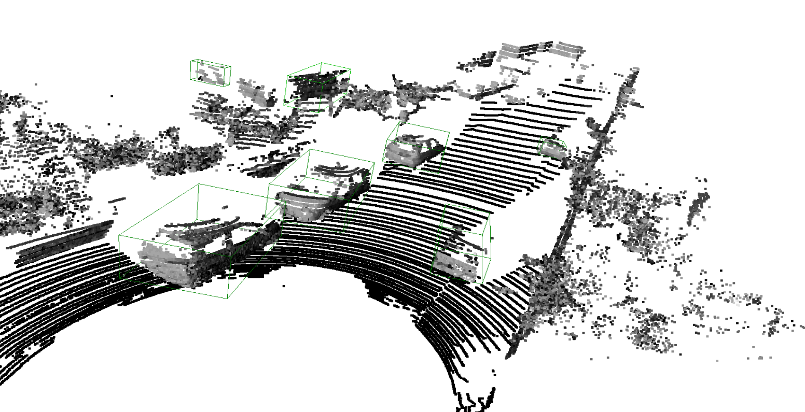
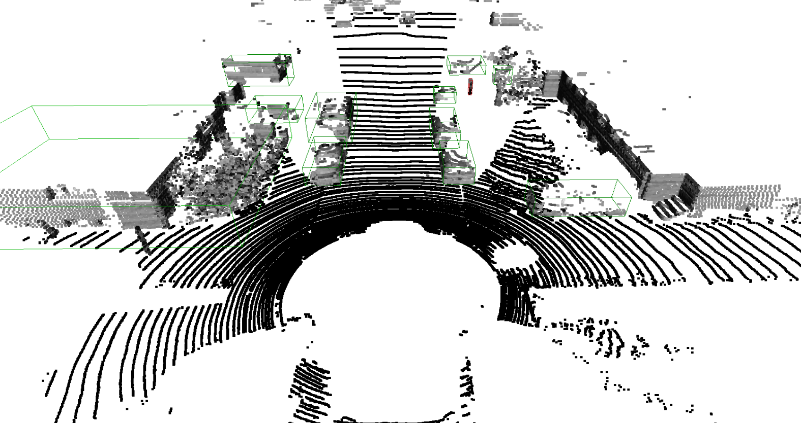
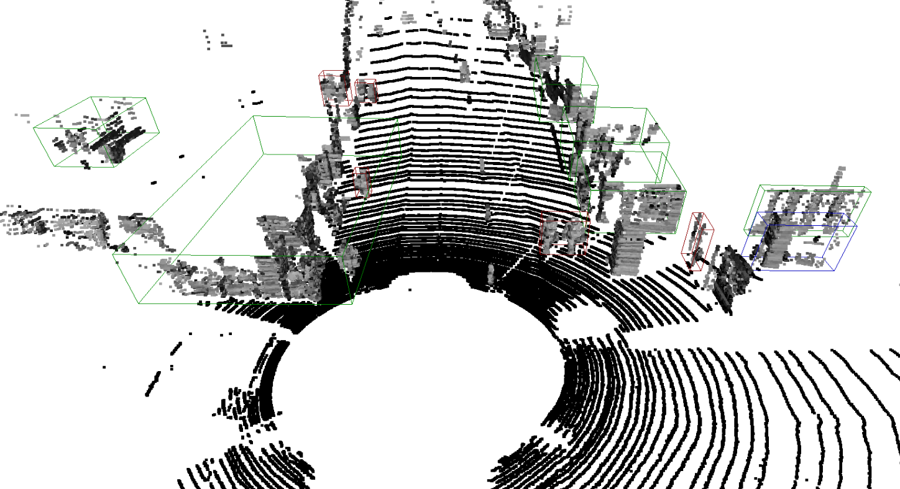
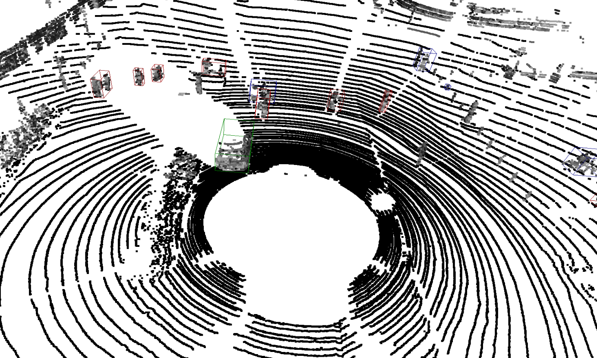
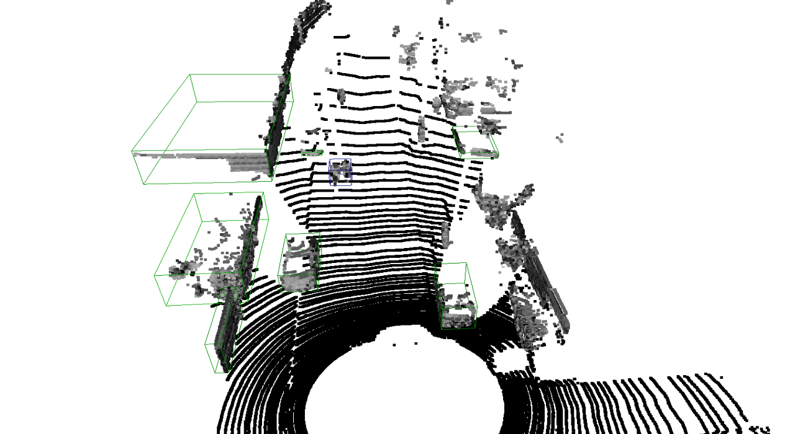

# Detection Pipeline on KITTI 3D Object Dataset

Python object detection pipeline on KITTI 3D Object dataset for Capstone Project One of [3D Point Cloud Processing](https://www.shenlanxueyuan.com/course/204) from [深蓝学院](https://www.shenlanxueyuan.com/)

---

## Solution Guide

---

### Build Object Classification Dataset from KITTI 3D Object

Before deep learning model training, a high quality object classification dataset must be built out of the original KITTI 3D Object dataset. The ETL tool, implemented in Python, is available at (click to follow the link) **[/workspace/assignments/project-01-kitti-detection-pipeline/extract.py](extract.py)**

#### Algorithm Workflow

The algorithm workflow in pseudo code is as follows. For each frame(velodyne-image-calib-label tuple) from KITTI 3D Object:

* First, perform **ground plane & object segmentation** on **Velodyne measurements**.
    * The implementation from [/workspace/assignments/04-model-fitting/clustering.py](assignment 04 of model fitting) is used here for region proposal 
* Build **radius-nearest neighbor** search tree upon segmented objects for later **label association**
* Then load label and associate its info with segmented objects as follows:
    * First, map **object center** from **camera frame** to **velodyne frame** using the parameters from corresponding calib file.
    * Query the search tree and identify a **coarse ROI**. 
        * The radius is determined using the dimensions of the bounding box. Euclidean transform is isometry.
    * Map the point measurements within the sphere into **object frame**.
    * Identify a **refined ROI** through **object bounding box filtering**.
    * Perform **non-maximum suppression on segmented object ids** for final label association:
        * Perform an ID-count on points inside the bounding box.
        * Identify the segmented object with maximum number of measurements inside the bounding box.
        * Associate the KITTI 3D Object label with the segmented object of maximum ID-count.
* Finally, write the **point cloud with normal** and corresponding **metadata** info persistent storage. 

#### Usage

Run the following commands to use the ETL tool:

```bash
# go to workspace:
cd /workspace/assignments/project-01-kitti-detection-pipeline
# activate environment:
conda activate kitti-detection-pipeline
# perform ETL on KITTI 3D Object dataset:
./extract.py -i /workspace/data/kitti-3d-object-detection/training/ -o /workspace/data/kitti_3d_object_classification_normal/
```

#### Visualization of Extracted Dataset

Sample visualization of the extracted classification dataset is as follows:

Camera View                |Lidar Pipeline View
:-------------------------:|:-------------------------:
  |  
  |  
  |  

--- 

### Dataset Analytics before Deep Learning Modelling

Before training the network, data quality check must be performed to minimize the effect of uneven class distribution, etc, on model building.

#### Class Distribution


The above visualization shows that the dataset has a **significantly uneven class distribution**. So measures must be taken to mitigate its effect on network training:

* Perform data augmentation through random rotation along z-axis, etc, to introduct more training instances
* Use focal loss for model optimization

The class distribution after resampling is show below. After resampling the dataset is more evenly distributed.



#### Influence of Distance on Measurement Density

For efficient deep-learning network training, all input point clouds should be transformed to the same size. However, the number and density of lidar measurements is influenced by the object's distance to ego vehicle. So measurement count analytics must be performed before choosing FoV and input size.



From the above visualization it's obvious that the number of measurements will drop significantly as the object moves away from ego vehicle. Since for real autonomous driving system only object which lies inside local map matters, here objects which are too far away from ego vehicle will be filtered out from the training set. The threshold can be determined using the local visualization below


Sample visualization of the resampled object point clouds are as follows. The ROI is defined as the area **<= 25 meters** away from ego vehicle. The measurements of each point cloud is resampled to **64** points for efficient deep network processing. 

Side View                |Top Down View
:-------------------------:|:-------------------------:
  |  
  |  
  |  

---

### Object Classification Network

PointNet++ with focal loss is used as object classification network.

#### Up & Running

Run the following commands to train the network on the resampled dataset:

```bash
# go to workspace:
cd /workspace/assignments/project-01-kitti-detection-pipeline/pointnet++
# activate environment:
conda activate kitti-detection-pipeline
# compile pointnet++ laysers:
tf_ops/compile_ops.sh
# train the network on the resampled dataset:
./train_modelnet.py
# visualize training loss on Tensorboard:
tensorboard --logdir=logs --bind_all --port=6006
```

After this the training loss can be monitored inside local browser at http://localhost:46006/

#### Training

The loss and categorical accuracy as training goes are shown below:


It can be read from the graph that **the categorical accuracy on validation set is around 0.96**

#### Testing

First is the classification report from sklearn:

```bash
              precision    recall  f1-score   support

     cyclist       0.97      0.97      0.97      1600
        misc       0.90      0.80      0.84      1157
  pedestrian       0.96      0.97      0.96      2225
     vehicle       0.95      0.98      0.96      3034

    accuracy                           0.95      8016
   macro avg       0.94      0.93      0.93      8016
weighted avg       0.95      0.95      0.95      8016
```

And the confusion matrix:


The following conclusions can be drawn from above data:

* **The Trained Model Generalizes Very Well on Test Set** 

    Because the categorical accuracy on validation and test sets are comparable.

* **The Model's Performance Bottleneck is on the Misc Classes** 

    The model has poor accuracies for misc class compared with the three types of traffic participants. This is caused by the great intrinsic variety of misc class due to its generation nature.

---

### Detection Pipeline

#### Algorithm Workflow

With the object classification network, the final object detection pipeline can be set up as follows:

* First, perform **ground plane & object segmentation** on **Velodyne measurements**.
* For each segmented **foreground object**, **preprocess** it according to **classification network input specification**. [click here](pointnet++/detect.py)
    * Filter out objects with too few measurements;
    * Filter object that is too far away from ego vehicle;
    * Resample object point cloud according to classification network input specification;
    * Substract mean to make the point cloud zero-centered.
* Run **batch prediction** on the above resampled point clouds and get **object category and prediction confidence**.
* Fit the cuboid using **Open3D axis aligned bounding box** in **Velodyne frame**, then transform to **camera frame** for **KITTI evaluation output**.

The corresponding Python implementation is shown below:

```python
    # 0. generate I/O paths:
    input_velodyne = os.path.join(dataset_dir, 'velodyne', f'{index:06d}.bin')
    input_params = os.path.join(dataset_dir, 'calib', f'{index:06d}.txt')
    output_label = os.path.join(dataset_dir, 'shenlan_pipeline_pred_2', 'data', f'{index:06d}.txt')

    # 1. read Velodyne measurements and calib params:
    point_cloud = measurement.read_measurements(input_velodyne)
    param = measurement.read_calib(input_params)

    # 2. segment ground and surrounding objects -- here discard intensity channel:
    segmented_ground, segmented_objects, object_ids = segmentation.segment_ground_and_objects(point_cloud[:, 0:3])

    # 3. predict object category using classification network:
    config = {
        # preprocess:
        'max_radius_distance': max_radius_distance,
        'num_sample_points': num_sample_points,
        # predict:
        'msg' : True,
        'batch_size' : 16,
        'num_classes' : 4,
        'batch_normalization' : False,
        'checkpoint_path' : 'logs/msg_1/model/weights.ckpt',
    }
    model = load_model(config)
    predictions = predict(segmented_objects, object_ids, model, config)
    
    # TODO: refactor decoder implementation
    decoder = KITTIPCDClassificationDataset(input_dir='/workspace/data/kitti_3d_object_classification_normal_resampled').get_decoder()

    # debug mode:
    if (debug_mode):
        # print detection results:
        for class_id in predictions:
            # show category:
            print(f'[{decoder[class_id]}]')
            # show instances:
            for object_id in predictions[class_id]:
                print(f'\t[Object ID]: {object_id}, confidence {predictions[class_id][object_id]:.2f}')

        # visualize:
        bounding_boxes = visualization.get_bounding_boxes(
            segmented_objects, object_ids, 
            predictions, decoder
        )
        o3d.visualization.draw_geometries(
            [segmented_ground, segmented_objects] + bounding_boxes
        )
    
    # 4. format output for KITTI offline evaluation tool:
    label = output.to_kitti_eval_format(
        segmented_objects, object_ids, param,
        predictions, decoder
    )
    label.to_csv(output_label, sep=' ', header=False, index=False)
```

#### Demos

Camera View                |Lidar View
:-------------------------:|:-------------------------:
  |  
  |  
  |  
  |  
  |  
  |  

#### Discussions

From the above visualization we can see that:

* **Pro: The Proposed Pipeline Performs Very Well on Simple Cases** 

    For object that is close enough to ego vehicle, which has dense enough measurements, the pipeline can detect the object very well. This can be seen in Demo 01 and 02 for foreground vehicles.

* **Con: The Pipeline Cannot Distinguish Objects That Are Too Close To Each Other** 

    This is caused by the simple regional proposal algorithm, DBSCAN. For a larger working range a larger clustering threshold must be used. However, this will cause small objects that are close to each other, like a group of pedestrians, to be clustered as a single group. This can be seen in Demo 03(`the two pedestrians`), 04(`the two pedestrians`) and 06(`the two cyclists`)

* **Con: The Proposed Pipeline Cannot Distinguish The Wall from The Vehicle** 

    This is because the two type of objects have similar features, a dominant flat surface, when only lidar measurements are used. This can be mitigated by integrating features from visual sensors(for object category from visual texture) and radar sensors(for dynamic vehicles)

---

### Evaluation

The full output from KITTI evaluation toolkit can be found here (click to follow the link) **[here](doc/evaluation-results)**. 

The summary statistics from KITTI Evaluation Tool is as follows:

```bash
# car detection:
car_detection AP: 52.398186 68.141006 69.044930
# pedestrian detection:
pedestrian_detection AP: 38.663311 40.115292 38.742714
# cyclist detection:
cyclist_detection AP: 37.225979 56.118141 53.791374
```

The three PR-curves for **Vehicle, Pedestrian and Cyclist** are shown below.


#### Discussions

* **The Pipeline Could Only Be Used as A Baseline Solution** 

    Due to the limit of lidar measurements, objects of similar shape cannot be effectively distinguished from each other. This is the root cause of the performance bottleneck.

* **However This is a PERFECT WRAP UP for the Course** 

    It really deepened my understanding of the whole object detection worklflow and the corresponding KPI metrics implementation. Thank you dear teacher & ShenLanXueYuan! All the best!


